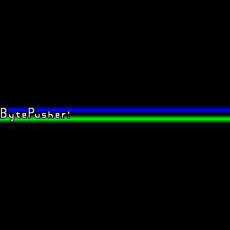

# bytepusher

BytePusher is a minimalist virtual machine. Minimalist in the sense that it is a One Instruction Set Computer [OISC](https://en.wikipedia.org/wiki/One-instruction_set_computer).

Examples  

  

  

  
